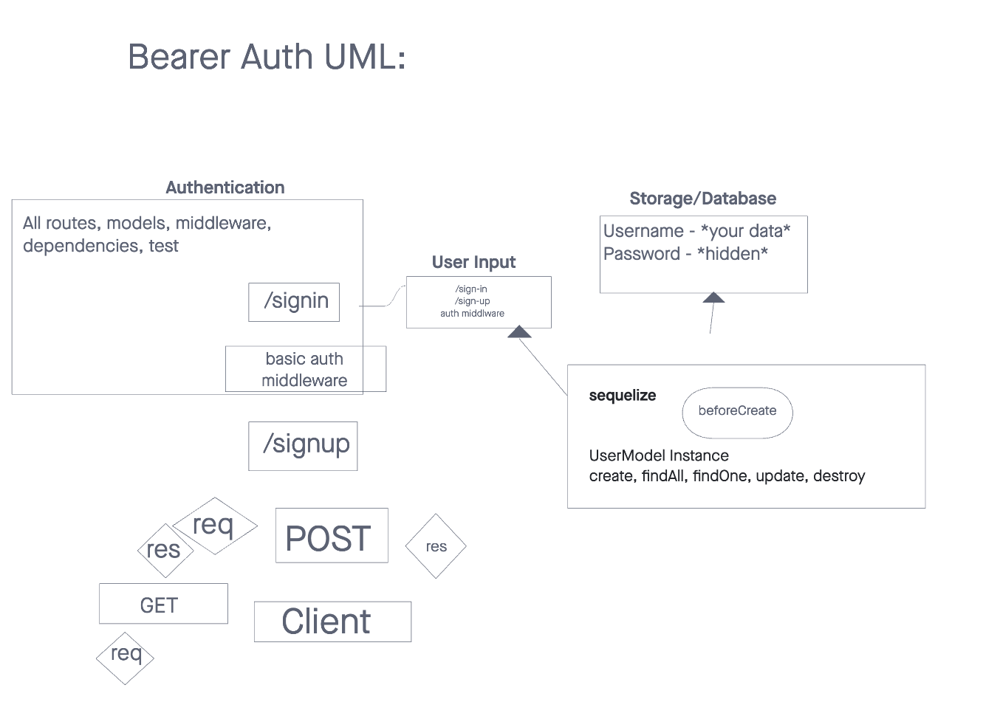
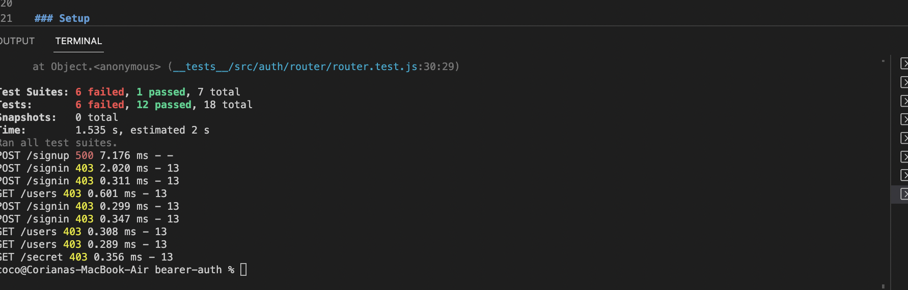

# bearer-auth
# LAB - Class 01

## Project: bearer-auth

### Author: Coriana Wiiliams

### Problem Domain

This very basic express server is used as a base for CI/CD deployment exercises

### Links and Resources

- [GitHub Actions ci/cd](https://github.com/Coriana1/bearer-auth/actions)
- [back-end dev server url](https://bearer-auth-17f9.onrender.com)

### Collaborators

Kenya Womack, starter code

### Setup

#### `.env` requirements (where applicable)

port variable exists within the env sample

#### How to initialize/run your application (where applicable)

clone repo, `npm i`, then run `nodemon` in the terminal

#### Routes

- GET : `/success` - specific route to hit

#### Tests

to run tests, after running `npm i`, run the command `npm test`

#### UML

